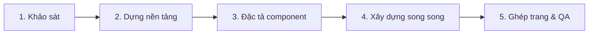

<div align="center">

# 🧭 ViClone Website

### Sao chép cấu trúc và giao diện website bằng AI, tái dựng thành ứng dụng Next.js sạch và hiện đại

Chỉ cần cung cấp URL cho AI coding agent, workflow `/clone-website` sẽ khảo sát giao diện, trích xuất tài nguyên, phân tích CSS/interaction và tổ chức lại thành mã nguồn Next.js có thể tiếp tục phát triển.

[](https://github.com/Base27-CVNSS/viclone-website/generate)
[](LICENSE)
[](https://nextjs.org/)

**Bản Việt hóa của [JCodesMore/ai-website-cloner-template](https://github.com/JCodesMore/ai-website-cloner-template).**  
Giữ nguyên giấy phép MIT và thông tin bản quyền của tác giả gốc.

[🚀 Bắt đầu nhanh](#-bắt-đầu-nhanh) · [🧠 Nguyên lý](#-nguyên-lý-hoạt-động) · [🏗️ Kiến trúc](#️-kiến-trúc-workflow) · [🛡️ Sử dụng có trách-nhiệm](#️-sử-dụng-có-trách-nhiệm)

</div>

---

## 🌐 ViClone Website là gì?

**ViClone Website** là template dành cho các AI coding agent, giúp **phân tích và tái dựng một website thành mã nguồn Next.js** theo quy trình có cấu trúc thay vì chỉ “chụp lại giao diện”.

Điểm cốt lõi của dự án không nằm ở một crawler đơn lẻ. Giá trị chính nằm ở **workflow điều phối AI nhiều giai đoạn**, hướng agent thực hiện tuần tự:

1. khảo sát website mục tiêu;
2. đo đạc bố cục, typography, màu sắc, responsive và interaction;
3. thu thập tài nguyên cần thiết;
4. viết đặc tả component;
5. dựng component độc lập;
6. ghép toàn trang;
7. kiểm tra trực quan và hiệu chỉnh sai khác.

Kết quả hướng tới một codebase có cấu trúc rõ ràng, có thể đọc, sửa, mở rộng và triển khai như một dự án Next.js thông thường.

> **Lưu ý:** Đây là công cụ hỗ trợ tái dựng giao diện và cấu trúc frontend. Nó không tự động chuyển toàn bộ backend, cơ sở dữ liệu, hệ thống tài khoản, API riêng, logic máy chủ hoặc quyền sở hữu trí tuệ của website mục tiêu.

---

## ✨ Điểm nổi bật

| Khả năng | Ý nghĩa |
|---|---|
| 🧭 **Khảo sát có hệ thống** | Chụp ảnh tham chiếu, kiểm tra nhiều trạng thái, responsive, hover/click/scroll và bố cục thực tế. |
| 🎨 **Trích xuất design token** | Thu thập màu sắc, font, khoảng cách, border, shadow, kích thước và các giá trị CSS quan trọng. |
| 🧩 **Đặc tả theo component** | Tách giao diện thành các khối rõ ràng trước khi triển khai, giảm việc AI “đoán mò”. |
| ⚡ **Xây dựng song song** | Có thể phân công nhiều agent/worktree xử lý các section hoặc component riêng biệt. |
| 🔍 **Visual QA** | So sánh kết quả dựng với ảnh tham chiếu để phát hiện sai lệch và tinh chỉnh. |
| 🧱 **Codebase hiện đại** | Next.js 16, React 19, TypeScript strict, Tailwind CSS v4, shadcn/ui. |
| 🤖 **Đa nền tảng AI** | Hỗ trợ Claude Code, Codex, Cursor, Gemini CLI, Cline, Roo Code, Continue, Amazon Q và nhiều công cụ khác. |

---

## 🎬 Demo tham chiếu

[](https://youtu.be/O669pVZ_qr0)

*Nhấn vào hình để xem demo của dự án gốc.*

---

## 🚀 Bắt đầu nhanh

### 1. Tạo repository riêng từ template

Không nên phát triển website mới trực tiếp trên repo mẫu. Hãy nhấn **Use this template / Dùng mẫu này** và tạo một repository mới trong tài khoản của bạn.

### 2. Clone repository mới về máy

```bash
git clone https://github.com/YOUR-USERNAME/YOUR-NEW-REPOSITORY.git
cd YOUR-NEW-REPOSITORY
```

### 3. Cài dependency

```bash
npm install
```

### 4. Khởi động AI coding agent

Ví dụ với Claude Code:

```bash
claude --chrome
```

Bạn cũng có thể dùng Codex CLI, Cursor, Gemini CLI, Cline, Roo Code hoặc nền tảng được hỗ trợ khác.

### 5. Chạy workflow tái dựng

```text
/clone-website <url-mục-tiêu-1> [<url-mục-tiêu-2> ...]
```

Ví dụ:

```text
/clone-website https://example.com
```

Nếu client không hỗ trợ slash command trực tiếp, có thể yêu cầu bằng ngôn ngữ tự nhiên:

```text
Clone https://example.com using the clone-website workflow
```

### 6. Kiểm thử và tùy biến

Sau khi dựng xong:

```bash
npm run check
```

Tiếp tục kiểm tra responsive, accessibility, đường dẫn asset, nội dung, animation, SEO và các interaction quan trọng trước khi triển khai.

---

## 🧰 Yêu cầu hệ thống

- **Node.js 24+**
- Một AI coding agent tương thích
- Git
- Trình duyệt hiện đại để khảo sát website mục tiêu
- Quyền hợp pháp để truy cập, phân tích và tái sử dụng tài nguyên cần thiết

---

## 🤖 Nền tảng AI được hỗ trợ

| Agent | Trạng thái |
|---|---|
| Claude Code | ✅ Khuyến nghị |
| Codex CLI | ✅ Hỗ trợ |
| OpenCode | ✅ Hỗ trợ |
| GitHub Copilot | ✅ Hỗ trợ |
| Kiro | ✅ Hỗ trợ |
| Cursor | ✅ Hỗ trợ |
| Windsurf | ✅ Hỗ trợ |
| Gemini CLI | ✅ Hỗ trợ |
| Cline | ✅ Hỗ trợ |
| Roo Code | ✅ Hỗ trợ |
| Continue | ✅ Hỗ trợ |
| Amazon Q | ✅ Hỗ trợ |
| Augment Code | ✅ Hỗ trợ |

Các bản skill/command tương ứng được đồng bộ từ nguồn cấu hình chung để giảm chênh lệch giữa nhiều agent.

---

## 🧱 Công nghệ sử dụng

| Thành phần | Công nghệ |
|---|---|
| Framework | **Next.js 16** – App Router |
| UI runtime | **React 19** |
| Ngôn ngữ | **TypeScript strict** |
| UI primitives | **shadcn/ui + Radix UI** |
| CSS | **Tailwind CSS v4** |
| Design token | **oklch** |
| Icon mặc định | **Lucide React** |
| Triển khai phù hợp | Vercel / Node.js / Docker |

---

## 🧠 Nguyên lý hoạt động

ViClone không “copy HTML rồi dán lại”. Workflow ưu tiên **reverse engineering giao diện theo quan sát thực tế**.



### 1. Khảo sát — Reconnaissance

Agent mở website mục tiêu và thu thập thông tin:

- ảnh chụp màn hình;
- kích thước/position thực tế;
- màu, font, spacing, radius, shadow;
- trạng thái hover/focus/active;
- nội dung thay đổi theo viewport;
- menu, tab, carousel, modal và các interaction;
- asset hình ảnh, SVG, video và SEO liên quan.

### 2. Dựng nền tảng — Foundation

Thiết lập phần dùng chung của ứng dụng:

- font;
- global CSS;
- design token;
- asset;
- layout;
- cấu trúc thư mục và primitive UI.

### 3. Đặc tả component — Component Specifications

Trước khi code, workflow ghi lại đặc tả chi tiết cho từng khối. Đây là bước quan trọng giúp agent khác có đủ ngữ cảnh để dựng chính xác mà không phải suy đoán lại từ đầu.

### 4. Xây dựng song song — Parallel Build

Các component/section có thể được phân cho nhiều agent hoặc worktree độc lập. Cách này tăng tốc khi website lớn nhưng vẫn giữ phạm vi thay đổi rõ ràng.

### 5. Ghép trang và kiểm định — Assembly & QA

Sau khi hoàn thiện component:

- ghép vào layout chung;
- sửa conflict;
- chạy lint/typecheck/build;
- so sánh ảnh kết quả với bản tham chiếu;
- tinh chỉnh các sai lệch về pixel, typography, spacing và responsive.

---

## 🏗️ Kiến trúc workflow

```text
URL mục tiêu
    │
    ▼
AI Coding Agent
    │
    ├── Khảo sát trình duyệt
    ├── Ảnh tham chiếu
    ├── CSS / design token
    ├── Asset / SVG / media
    └── Interaction model
    │
    ▼
docs/research/
Đặc tả kỹ thuật theo component
    │
    ▼
Builder agents / worktrees
    │
    ▼
src/app + src/components + public/
    │
    ▼
Lint + Typecheck + Build + Visual QA
```

Bản chất của kiến trúc này là tách **quan sát → đặc tả → triển khai → kiểm định** thành các pha riêng. Điều đó làm giảm lỗi do AI tự suy diễn và giúp quá trình tái dựng có thể kiểm tra, lặp lại và bảo trì tốt hơn.

---

## 📂 Cấu trúc dự án

```text
src/
  app/                # Route và layout Next.js
  components/         # React component
    ui/               # shadcn/ui primitives
  lib/                # Hàm tiện ích
  types/              # Kiểu TypeScript
  hooks/              # React hooks

public/
  images/             # Hình ảnh lấy từ website mục tiêu
  videos/             # Video/tài nguyên media
  seo/                # Favicon, OG image, metadata asset

docs/
  research/           # Kết quả khảo sát và đặc tả component
  design-references/  # Ảnh tham chiếu / visual diff

scripts/
  sync-agent-rules.sh # Đồng bộ hướng dẫn cho các agent
  sync-skills.mjs     # Đồng bộ skill /clone-website

AGENTS.md             # Nguồn hướng dẫn agent chính
.claude/skills/...    # Skill nguồn cho Claude Code
```

---

## ⌨️ Lệnh phát triển

```bash
npm run dev        # Chạy môi trường phát triển
npm run build      # Build production
npm run lint       # Kiểm tra ESLint
npm run typecheck  # Kiểm tra TypeScript
npm run check      # lint + typecheck + build
```

### Docker

```bash
docker compose up app --build
```

Chế độ phát triển:

```bash
docker compose up dev --build
```

---

## 🔄 Đồng bộ cấu hình cho nhiều AI agent

Dự án dùng các file nguồn làm **single source of truth** rồi sinh bản tương ứng cho từng nền tảng.

| Nội dung | File nguồn | Lệnh đồng bộ |
|---|---|---|
| Hướng dẫn agent | `AGENTS.md` | `bash scripts/sync-agent-rules.sh` |
| Skill `/clone-website` | `.claude/skills/clone-website/SKILL.md` | `node scripts/sync-skills.mjs` |

Điều này giúp tránh việc sửa riêng từng bản dành cho Cursor, Cline, Roo, Gemini, Amazon Q… rồi dẫn đến sai lệch workflow.

---

## 💡 Trường hợp sử dụng phù hợp

- 🔁 **Di chuyển nền tảng:** chuyển frontend của website bạn sở hữu từ WordPress/Webflow/Squarespace sang Next.js.
- 🧯 **Khôi phục frontend:** website vẫn hoạt động nhưng mã nguồn cũ bị thất lạc hoặc stack đã lỗi thời.
- 🎓 **Học frontend:** phân tích cách website thực tế xử lý layout, responsive, animation và component.
- 🧪 **Prototype:** tái dựng nhanh một giao diện tham chiếu để nghiên cứu UX/UI trước khi thiết kế lại.
- 🗂️ **Lưu trữ nội bộ:** tái dựng các giao diện thuộc quyền quản lý để phục vụ bảo tồn, chuyển đổi hoặc hiện đại hóa hệ thống.

---

## ⚠️ Giới hạn

ViClone **không đảm bảo** tự động khôi phục được:

- backend riêng;
- cơ sở dữ liệu;
- API private;
- authentication/authorization;
- logic server-side không lộ ra phía client;
- hệ thống thanh toán;
- nội dung bị giới hạn quyền;
- tài nguyên có DRM hoặc cơ chế chống sao chép;
- toàn bộ hành vi của ứng dụng phức tạp chỉ từ một lần quét.

Độ chính xác phụ thuộc vào website, quyền truy cập, khả năng browser automation và chất lượng model/agent đang sử dụng.

---

## 🛡️ Sử dụng có trách nhiệm

Dự án này phục vụ **phát triển phần mềm, nghiên cứu, migration, phục hồi hệ thống và học tập hợp pháp**.

Không sử dụng để:

- giả mạo website/tổ chức/cá nhân;
- tạo trang phishing hoặc thu thập thông tin đăng nhập;
- đánh cắp thương hiệu, logo, nội dung hoặc tài sản có bản quyền;
- vượt qua cơ chế truy cập trái phép;
- vi phạm điều khoản dịch vụ hoặc pháp luật áp dụng.

Trước khi tái dựng một website, hãy kiểm tra quyền sở hữu, giấy phép, điều khoản sử dụng, robots policy và quyền đối với nội dung/tài nguyên liên quan.

---

## 🌏 Ngôn ngữ

- 🇻🇳 **Tiếng Việt:** `README.md`
- 🇬🇧 English: [`README.en.md`](README.en.md)
- 🇯🇵 日本語: [`README.ja.md`](README.ja.md)
- 🇨🇳 简体中文: [`README.zh-CN.md`](README.zh-CN.md)

---

## 🙏 Ghi công dự án gốc

ViClone Website được Việt hóa và tổ chức lại tài liệu dựa trên:

**[JCodesMore/ai-website-cloner-template](https://github.com/JCodesMore/ai-website-cloner-template)**

Giấy phép gốc: **MIT License**. Thông tin bản quyền được giữ nguyên trong [`LICENSE`](LICENSE).

---

## 📜 Giấy phép

Phân phối theo **MIT License**. Xem đầy đủ tại [`LICENSE`](LICENSE).

> Khi tái sử dụng mã nguồn, cần giữ lại thông báo bản quyền và điều khoản MIT theo nội dung giấy phép.
